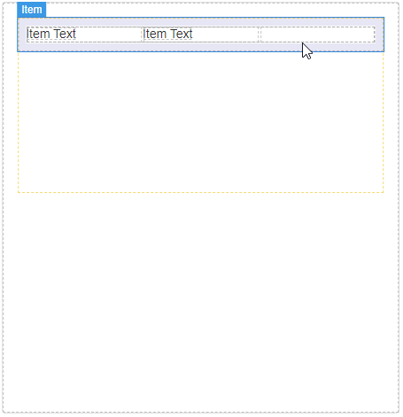
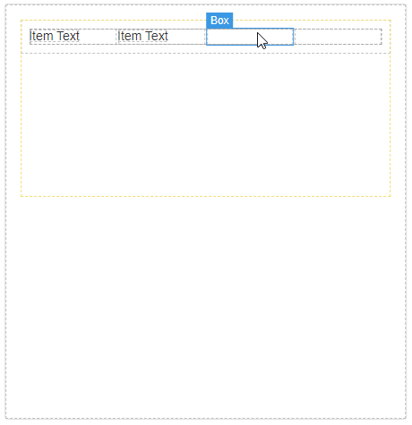
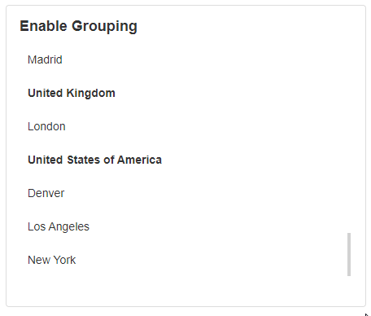

# Templated List

Templated Lists allow you to display a list of data to the users. This is useful for displaying information from a Data Source such as a database. It is also useful to group information so the user can see a list of items underneath their corresponding categories and expand and collapse them as needed.

.png>)

## How to Add items to a Templated List

Columns of data can be added to a Templated List on the canvas. To add an item, select one of the fields and click on the plus symbol to add a new field next to it. Fields can also be cloned by clicking on the clone button from the same top-right hand toolbar.&#x20;


[See the Canvas article for more details on these controls.](../../concepts/application/canvas.md#block-toolbar)&#x20;


To bind a column to a particular field from the Data Source, highlight the text in one of the columns and modify the _text_ property under Appearance in Block Properties&#x20;

## How to Delete Templated List items&#x20;

To delete an item in the templated list, highlight one of the boxes and click on the delete button in the toolbar.


[See the Canvas article for more details on these controls.](../../concepts/application/canvas.md#block-toolbar)&#x20;


## Templated List Properties

### Appearance

#### Common Properties&#x20;

The templated list has properties that are common to most Blocks: _visibility_ and _tooltip_.

[See the Common Properties article for more details on common appearance properties.](../common-properties.md#appearance)

#### Enable Paging

When paging is enabled, the items in the list will be grouped into pages.&#x20;

.png>)

#### Page Size

You can specify the number of items that display on the page at any given time.

#### Scrolling Mode

If enable paging is off, only _virtual_, _infinite_ and _none_ scrolling mode options will be available. If enable paging is on, only the _standard_ and _none_ scrolling mode options will be available.

.png>)

### Behavior

#### Common Properties

The _disabled_ property is common to most Blocks;

[See the Common Properties article for more details on common behavior properties.](../common-properties.md#behavior)

#### Search Enabled

The _search enabled_ option shows a search bar at the top of the list. This lets the user search for a particular record.

.png>)

### Data Source

#### Common Properties

If you bind a data source to the templated list, the text labels for each column will need to bind to the columns coming from the data source. Once this is configured, data from the database will display in the list.&#x20;

The templated list has properties that are common to most Blocks: _filter, sort, show # of results_, and _skip # of results;_

[See the Common Properties article for more details on common Data Source properties.](../common-properties.md#data-source)

The Data Source property is required for Templated Lists.

### Grouping

#### Enable Grouping

You can choose to group the items on the list by the columns. In the designer mode, when the enable grouping option is selected, a new group field will appear which will act as the area where the grouping headings will be displayed.

If Grouping is Enabled, the Group By Expression property is required for Templated Lists.

.png>)

This will categorize related records together, which can be expanded and viewed when the application is launched.

.png>)

#### Allow Collapsing and Expand by Default

_Allow collapsing_ lets the user collapse the contents of the group so they are temporarily hidden. If this is set to false, the user will be unable to collapse the grouped content. Expand by default determines if the list items are collapsed or expanded by default.

### Action

#### Common Properties

The templated list has properties that are common to most Blocks: _navigate to, update data sources,_ and _show confirmation dialog;_

[See the Common Properties article for more details on common action properties.](../common-properties.md#action)
